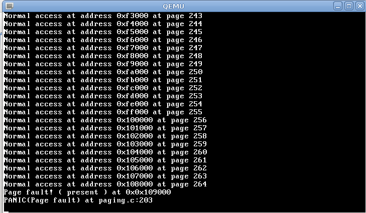

# SDP - Lab 4 - Davide Gallitelli S241521

### Ex 4.1 

The goal of this exercise is to understand how the kenel manages virtual memory and how it handles page fault. After initialising pages, we set the pointer the 0, which represents the starting point for memory access. We try to load the _do\_page\_fault_ variable with the content the page pointed by _ptr_, if no page fault happens, an output is printed to console by means of _monitor\_write_ prcedures, and the pointer is incremented by 1024 to point to the next page, because the page size is 4096. Otherwise, the kernel generates a PANIC.

```c
u32int i = 0;
u32int *ptr = (u32int) 0x0;
u32int do_page_fault;
while(1){
	do_page_fault = *ptr;
	monitor_write("Normal access at address ");
	monitor_write_hex(ptr);
	monitor_write(" at page ");
	monitor_write_dec(i);
	monitor_write("\n");
	ptr = ptr + (u32int)1024;
	i++;
}
```



The maximum value obtained this way is 264, with an address of 0x10800, which is 1.081.344 in decimal. This number represents the size of the page_table, which is made of 1024 entries, each 32-bits long, for a total of 32.768 bits, and the frames allocated. In particular, with 20 bits available for addressing a frame, the number of frames available is 2^20, which is equal to 1.048.576 . The sum of these two numbers represents exactly the maximum address that can be accessed by our kernel, without generating a page fault.

We can notice that the page fault generated this way is a _"Page Fault! (present)_. Analyzing the file _paging.c_, which is the one containing all the information regarding to the paging done on the physical memory of our simulated environment by the kernel, there is a section which sets a flag according to the kind of page fault generated. In our case, it shows that the page is not present in memory, therefore cannot be accessed by the program. The other possible flags and related messages are the following:

```c
// The error code gives us details of what happened.
    int present   = !(regs.err_code & 0x1); // Page not present
    int rw = regs.err_code & 0x2;           // Write operation?
    int us = regs.err_code & 0x4;           // Processor was in user-mode?
    int reserved = regs.err_code & 0x8;     // Overwritten CPU-reserved bits of page entry?
    int id = regs.err_code & 0x10;          // Caused by an instruction fetch?

    // Output an error message.
    monitor_write("Page fault! ( ");
    if (present) {monitor_write("present ");}
    if (rw) {monitor_write("read-only ");}
    if (us) {monitor_write("user-mode ");}
    if (reserved) {monitor_write("reserved ");}
```