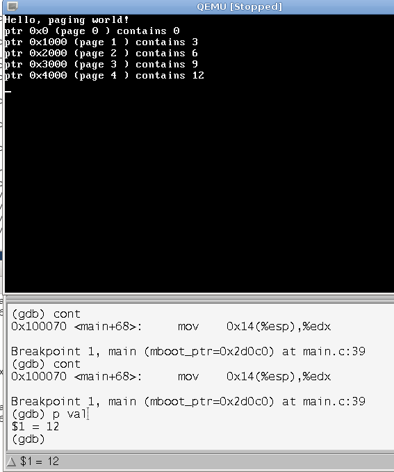
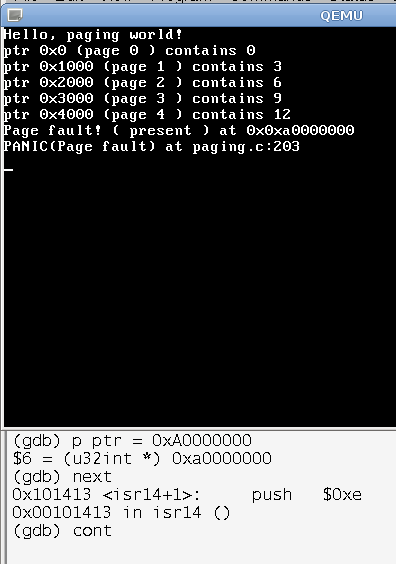
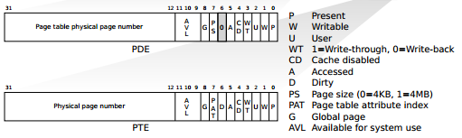

# SDP - Lab 4 - Davide Gallitelli S241521

### Ex 4.2

For the second exercise, the code of _main.c_ from exercise 1 was modified in order to write the page number multiplied by 3 on the first address of each page.

```c
u32int *ptr = (u32int*)0x00000000;
u32int i = 0, val = 0;
u32int do_page_fault = 0;

while(1){
	val = i*3;
	*ptr = val;
	do_page_fault = *ptr;
	monitor_write("ptr ");
	monitor_write_hex(ptr);
	monitor_write(" (page ");
	monitor_write_dec(i);
	monitor_write(") ");
	monitor_write("contains ");
	monitor_write_dec(*ptr);
	monitor_write("\n");
	ptr = ptr + (u32int)1024;
	i++;
}
```



Another task issued was to manually edit the address when looking for page 5, in order to generate a page fault exception. This was done by exploiting _ddd_ functionality to modify variables - the address was set to a value known not to be outside of the memory, _0xA0000000_ by means of the command:

```
p ptr = 0xA0000000
```

Any value higher than _0x0109000_ would generate a page fault, as we know from ex 1 that only 264 pages are initialised. 



Analyzing the _paging.h_ file provided by the mini kernel, it is possible to study the data structure of the directory page table, defined by means of the _page\_directory\_t_ data structure, and the page table, with data structure _page\_table\_t_:

```c
typedef struct page_table
{
    page_t pages[1024];
} page_table_t;

typedef struct page_directory
{
    /**
       Array of pointers to pagetables.
    **/
    page_table_t *tables[1024];
    /**
       Array of pointers to the pagetables above, but gives their *physical*
       location, for loading into the CR3 register.
    **/
    u32int tablesPhysical[1024];

    /**
       The physical address of tablesPhysical. This comes into play
       when we get our kernel heap allocated and the directory
       may be in a different location in virtual memory.
    **/
    u32int physicalAddr;
} page_directory_t;
```

The _page\_t_ data structure shows the structure of a Page Table Entry (PTE) and Page Directory Entry (PDE):

```c
typedef struct page
{
    u32int present    : 1;   // Page present in memory
    u32int rw         : 1;   // Read-only if clear, readwrite if set
    u32int user       : 1;   // Supervisor level only if clear
    u32int accessed   : 1;   // Has the page been accessed since last refresh?
    u32int dirty      : 1;   // Has the page been written to since last refresh?
    u32int unused     : 7;   // Amalgamation of unused and reserved bits
    u32int frame      : 20;  // Frame address (shifted right 12 bits)
} page_t;
```



For short, for a 32 bits entry of the page table, there are 12 reserved bits for flags, along with 20 bits of physical page number  - the frame address. A maximum number of 2^20 frames can be addressed with this address. A page table is composed of 1024 of those entries. 

From the data structure above, the page directory table has a different structure: each entry has two pointers to the previously defined pagetables, one for the "logical" pointer, and one for its physical location. A physical address is also provided.