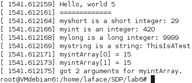

## Lab 6 Ex 1 - SDP - Davide Gallitelli S241521

In order to install a kernel module, it is necessary to compile the desired program in a way that the compiler, in our case GCC, generates a _kernel object_ file, which can be installed as module. This is done by the _Makefile_, which only needs the command _make all_ to create the object file.

The module is then installed by means of the _insmod_ command, which also allows for specifying parameters. The results obtained below are obtained after launching the following command:

Once a module has been installed, the results can be seen in three different locations:
- the _/var/log/kern.log_ file

- the _/var/log/messages_ file

- by means of the _!dm_ command

