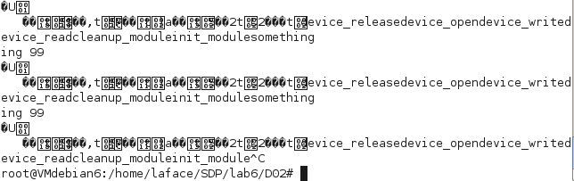
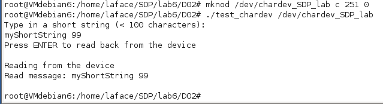
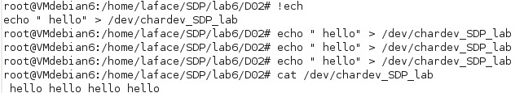

## Lab 6 Ex 2 - SDP - Davide Gallitelli S241521

The code of the original _chardev\_SDP\_Lab_ driver, provided among the sources for this lab, generates an unexpected result from the command _cat_, due to a problem in the reading of the special file _/dev/chardev\_SDP\_lab_.



However, the file can be correctly read by means of the provided _test\_chardev.c_ file:



This is caused by _cat_ behaviour, which tries to read 32K worth of data from the file specified as its argument, and the driver does not manage in any way the file dimension and EOF.

In order to solve this, a global variable has been introduced in the driver, _bytes\_written_, which is updated with the number of bytes whenever the device is opened in order to be written by a program. The _device\_write_ method now contains:

```
if (bytes_written != 0) bytes_written--;
ret = copy_from_user(char_dev_buf+bytes_written, buff, count);
bytes_written += count-ret;
return count;
```

The decrement operator of the first line is there to allow for multiple data insert: the "offset" represented by the global variable is moved one step backward so that the CR character is overwritten. Then, it is incremented, after the _copy\_from\_user_ function by the _count_ value, which represents the actual bytes written, minus _ret_, which are the bytes that could not be written, if any.

Then, this value is used in the _device\_read_ method:

	unsigned long ret;
	count = (size_t) bytes_written;
	printk(KERN_INFO "My count is: %d\n", count);
	ret = copy_to_user(buff, char_dev_buf, count);
	printk(KERN_INFO "Number of bytes that could not be copied: %lu \n", ret);
	bytes_written = 0;
	return count;

The variable _bytes\_written_ is used to update the _count_ variable, which is used to know how many bytes are to be read from the file. After the read is done, it is then reset to 0, so that no more bytes will be read at the next iteration.

A proof that the program is working correctly is in the following screenshot:

